# Лабораторна робота №1.2

**Тема:** Робота з файлами та даними у C#  
**Студентка:** Максименко Марія  
**Група:** КН-22  
**Варіант:** 21  
**Набір даних:** Medical Insurance Cost Dataset  
**Дата:** 02.10.2026

## 1. Мета роботи

Розробити застосунок для імпорту, перегляду, обробки, аналізу, візуалізації та експорту даних медичного страхування у форматах CSV, JSON, XML і XLSX.

## 2. Завдання

У межах роботи необхідно було реалізувати:

- імпорт даних із CSV, JSON, XML та XLSX;
- параметри імпорту й попередній перегляд даних;
- фільтрацію, пошук, сортування та групування записів;
- додавання, редагування, видалення і валідацію записів;
- експорт у CSV, JSON, XML та XLSX;
- формування XLSX- і DOCX-звітів;
- побудову графіків та їх експорт у PNG;
- роботу з недавніми файлами й обробку помилок файлової системи.

## 3. Опис набору даних

Для аналізу використано набір даних про вартість медичного страхування. Файл `insurance.csv` містить **1338 записів** та сім полів.

| Поле | Опис | Тип даних |
|---|---|---|
| `age` | вік людини | ціле число |
| `sex` | стать | текст |
| `bmi` | індекс маси тіла | число |
| `children` | кількість дітей | ціле число |
| `smoker` | статус куріння | текст |
| `region` | регіон проживання | текст |
| `charges` | вартість страхування | число |

Джерело набору даних: [Medical Insurance Cost Dataset на Kaggle](https://www.kaggle.com/datasets/mosapabdelghany/medical-insurance-cost-dataset).

## 4. Засоби розробки

У програмі використано:

- C#, .NET 9 і Windows Forms;
- ScottPlot для побудови графіків;
- ClosedXML для роботи з XLSX-файлами;
- EPPlus для формування XLSX-звітів;
- DocumentFormat.OpenXml для створення DOCX-звітів;
- `System.Text.Json` для JSON;
- `System.Xml.Serialization` для XML.

## 5. Архітектура застосунку

Проєкт поділено на три збірки:

- **Domain** — сутності предметної області, інтерфейси й правила валідації;
- **Data** — постачальники форматів даних, сервіси імпорту, експорту, аналізу та формування звітів;
- **UI** — графічний інтерфейс Windows Forms.

### 5.1. Діаграма сутностей предметної області

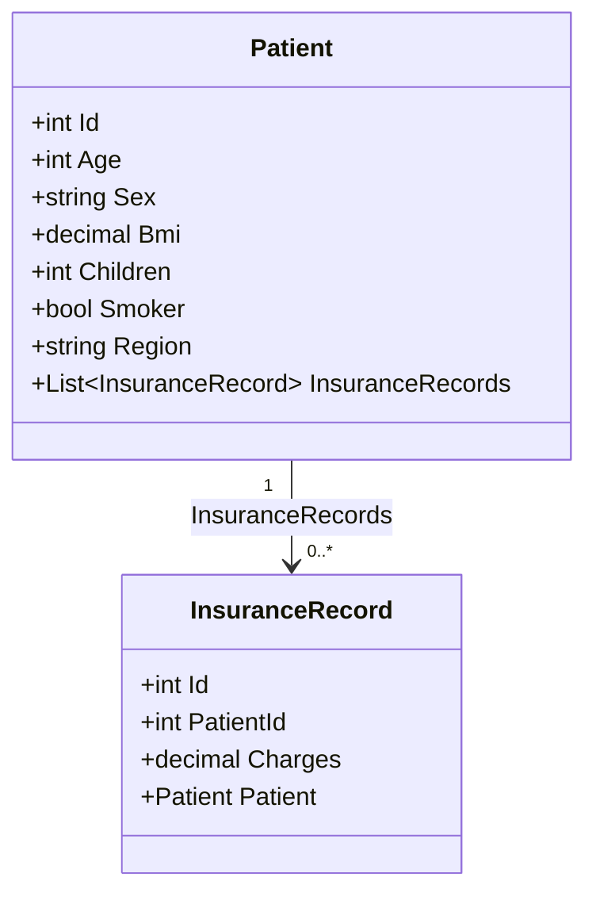

У предметній області виділено дві сутності. `Patient` зберігає персональні та медичні характеристики людини: вік, стать, індекс маси тіла, кількість дітей, статус куріння й регіон проживання. `InsuranceRecord` зберігає інформацію про страховий запис і його вартість (`Charges`). Такий поділ дає змогу відокремити дані людини від даних про страхування.

Між сутностями встановлено зв'язок «один-до-багатьох»: один пацієнт може мати нуль або більше страхових записів. Цей зв'язок реалізовано в коді властивостями `Patient.InsuranceRecords` та `InsuranceRecord.Patient`.

## 6. Імпорт даних

Застосунок підтримує завантаження файлів CSV, JSON, XML і XLSX. Для CSV можна обрати кодування, роздільник, десятковий роздільник та вказати наявність заголовка. Перед імпортом відображається попередній перегляд перших рядків, кількість записів і стовпців, типи полів та кількість пропусків.

На рисунку 1 показано імпорт файлу `insurance.csv`. У попередньому перегляді визначено 1338 рядків, 7 стовпців і відсутність пропусків.

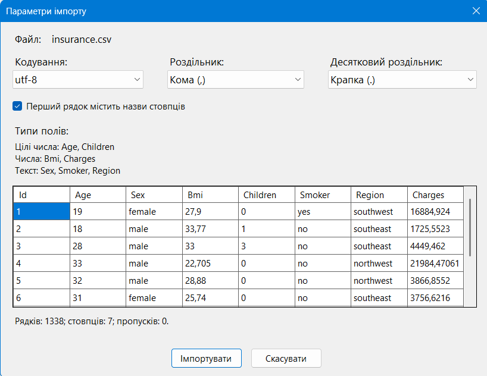

*Рисунок 1 — Параметри імпорту та попередній перегляд набору даних.*

## 7. Обробка даних

На головній формі реалізовано:

- фільтрацію за віком, BMI, кількістю дітей і вартістю страхування;
- фільтрацію за статтю, статусом куріння та регіоном;
- пошук за вибраним полем;
- сортування за основними полями у прямому й зворотному порядку;
- додавання, редагування та видалення записів;
- посторінковий перегляд таблиці.

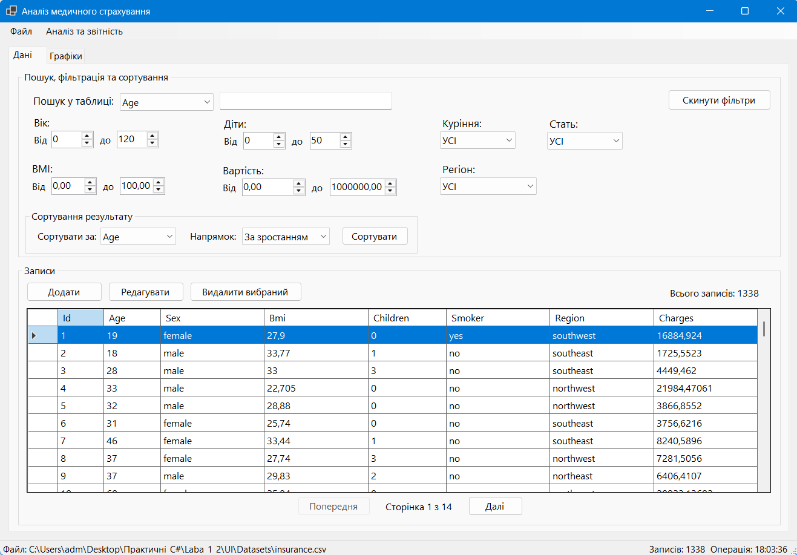

*Рисунок 2 — Головна форма застосунку з елементами пошуку, фільтрації, сортування та таблицею записів.*

## 8. Експорт даних

Дані можна зберегти у форматах CSV, JSON, XML і XLSX. Для CSV доступні параметри кодування та роздільника, а для XLSX — назва аркуша. Також програма містить діалоги Open/Save, список останніх файлів і перевірку блокування файла.

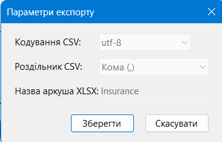

*Рисунок 3 — Діалог параметрів експорту даних.*

## 9. Формування звітів

Програма створює XLSX- та DOCX-звіти.

XLSX-звіт містить підсумкові таблиці за регіоном, статтю та статусом куріння. Для кожної групи виводиться кількість записів, середня вартість страхування, середній вік, середня кількість дітей і середній BMI. На аркушах також формуються стовпчикові діаграми.

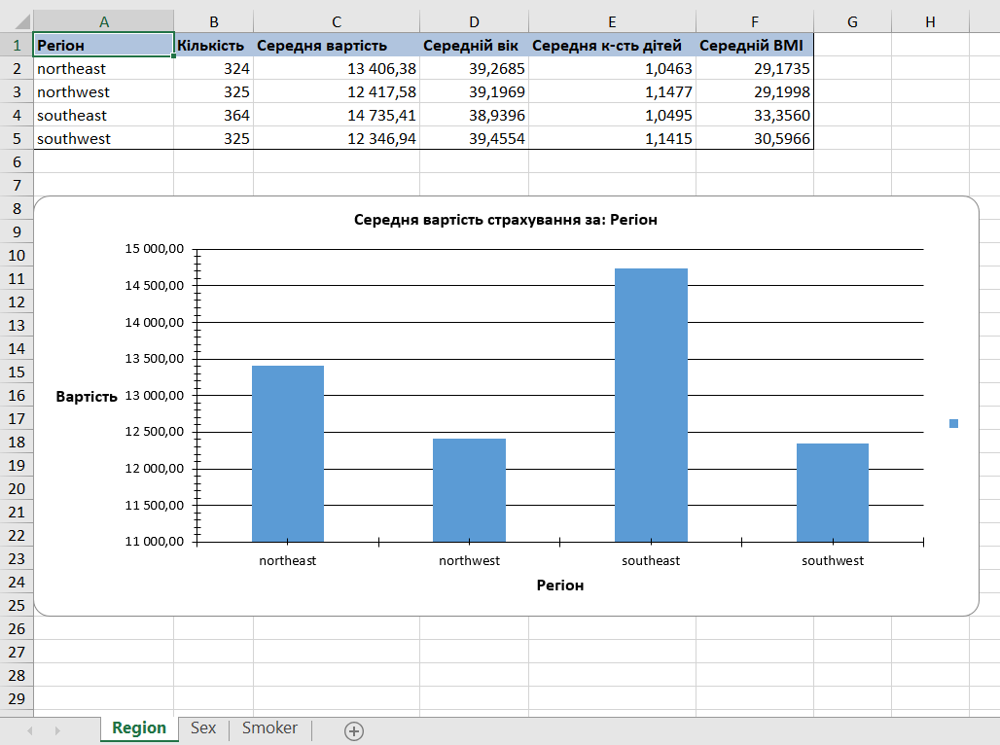

*Рисунок 4 — Аркуш XLSX-звіту з групуванням за регіоном і діаграмою.*

DOCX-звіт містить титульну сторінку з даними студентки, варіантом і коротким описом набору даних.

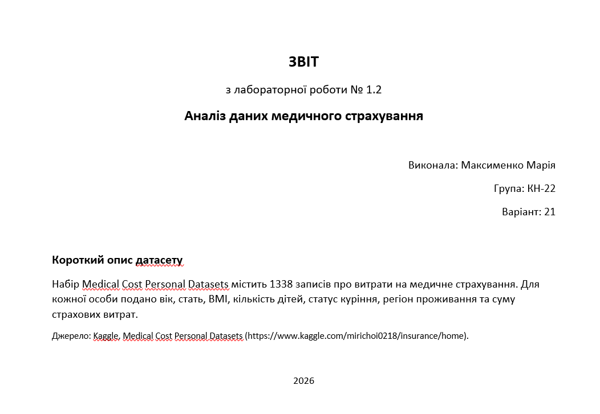

*Рисунок 5 — Титульна сторінка сформованого DOCX-звіту.*

У DOCX-звіті також подано таблицю ключових показників, текстовий висновок та графіки, збережені у PNG.

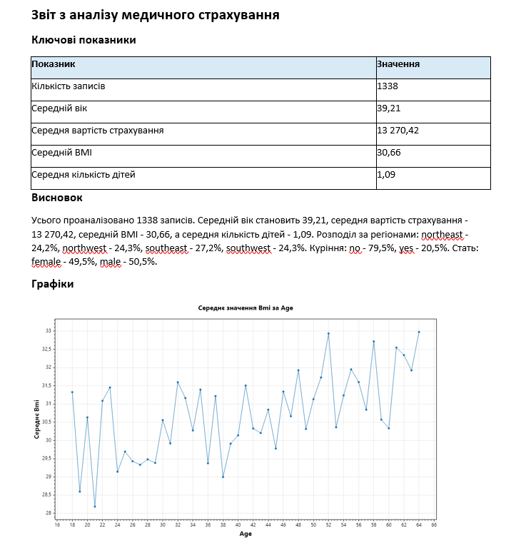

*Рисунок 6 — Ключові показники та графік у DOCX-звіті.*

## 10. Візуалізація даних

Для побудови графіків використано бібліотеку ScottPlot. Користувач обирає тип графіка та поля, за якими виконується побудова. Реалізовано лінійний, стовпчиковий і круговий графіки. Кожен графік можна зберегти у форматі PNG.

Лінійний графік, який демонструє залежність середньої вартості страхування від віку.

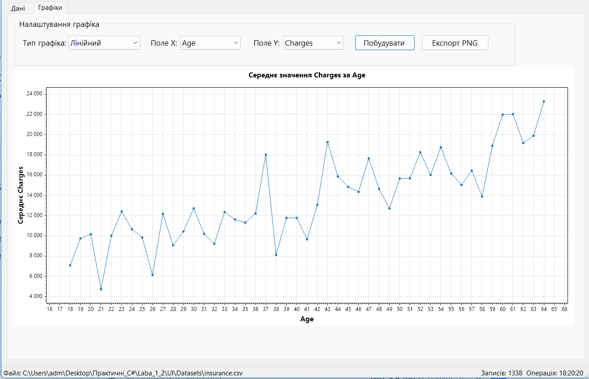

*Рисунок 7 — Середня вартість страхування залежно від віку.*

Стовпчиковий графік, який показує різницю середньої вартості страхування для людей, які курять і не курять.

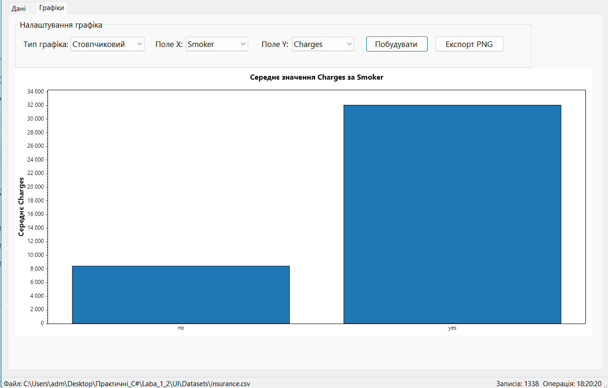

*Рисунок 8 — Середня вартість страхування за статусом куріння.*

Круговий графік, який відображає розподіл записів за регіонами.

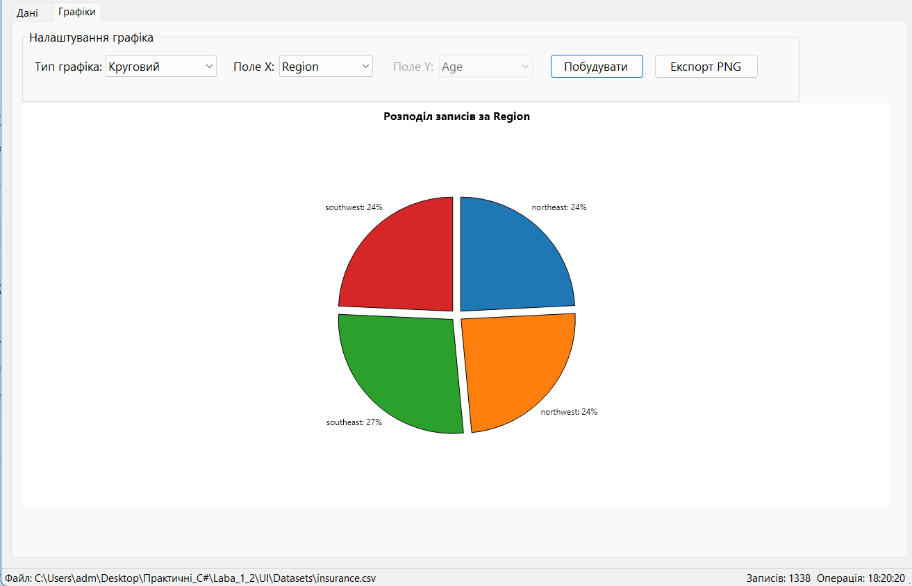

*Рисунок 9 — Розподіл записів за регіонами.*

## 11. Аналіз даних

Окрема форма аналізу дозволяє групувати дані за регіоном, статтю або статусом куріння та обрати числове поле для розрахунку. Для кожної групи визначаються кількість записів, середнє, мінімальне та максимальне значення.

На рисунку 10 наведено результат групування за регіоном для поля «Вартість страхування». Найбільша середня вартість страхування у цьому наборі даних спостерігається в регіоні `southeast`.

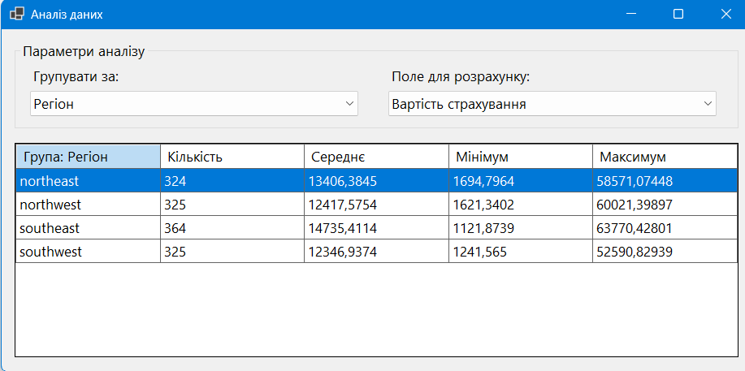

*Рисунок 10 — Результат групування даних за регіоном.*

## 12. Результати аналізу

Для початкового набору даних отримано такі ключові показники:

| Показник | Значення |
|---|---:|
| Кількість записів | 1338 |
| Середній вік | 39,21 |
| Середній BMI | 30,66 |
| Середня кількість дітей | 1,09 |
| Середня вартість страхування | 13 270,42 |

Під час групування за регіоном найбільше записів має `southeast` — 364. Середня вартість страхування у цьому регіоні також є найбільшою серед інших регіонів.

## 13. Висновок

У межах роботи створено застосунок для комплексної роботи з даними медичного страхування. Програма підтримує імпорт і експорт поширених форматів, попередній перегляд даних, пошук, фільтрацію, сортування, редагування та аналіз записів. Додатково реалізовано візуалізацію даних, експорт графіків у PNG і формування XLSX- та DOCX-звітів.
